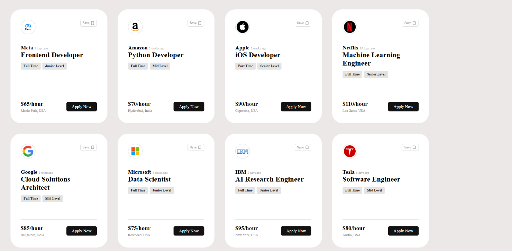
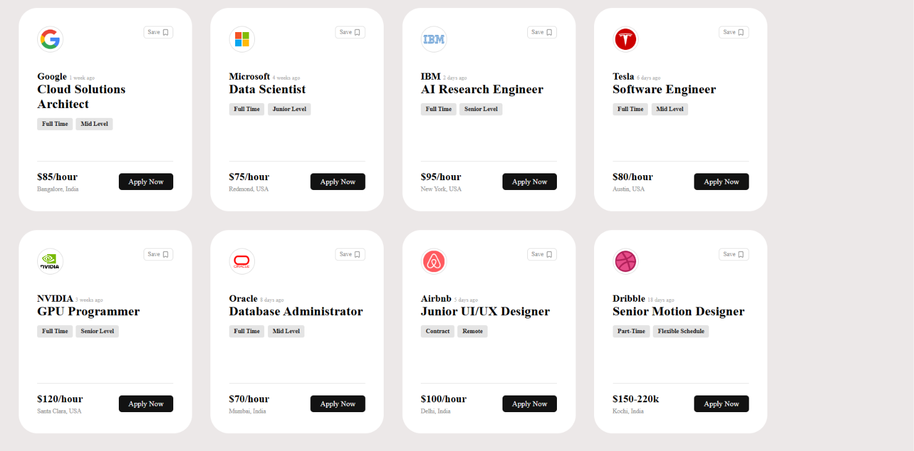

# React Job Cards UI – Responsive Job Listing Interface

A modern and responsive **Job Listing Card UI** built using **React.js and Vite**.

This project was created while learning React fundamentals and focuses on building reusable components, passing data through props, rendering dynamic content using array methods, and creating a clean responsive user interface.

## 🚀 Live Demo

**Live Demo:** https://react-job-cards-ui-mu.vercel.app/

## 📸 Screenshot

o Screenshot 1:

o Screenshot 2:


## 📌 About the Project

This project displays a collection of job-opening cards for different companies.

Each card dynamically displays:
* Company logo
* Company name
* Date posted
* Job title
* Employment type
* Experience level
* Salary
* Location
* Save button
* Apply Now button

The project initially contained job cards for several technology companies, and additional **Airbnb** and **Dribbble** cards were added as extra practice.

## ✨ Features

* Responsive job card layout
* Reusable React Card component
* Dynamic rendering using `.map()`
* Props-based data passing
* Company logos and job information
* Save button with Lucide React icon
* Apply Now button
* Clean and modern UI
* Vite-powered development environment

## 🛠️ Technologies Used

* **React.js**
* **JavaScript (ES6+)**
* **HTML5**
* **CSS3**
* **Vite**
* **Lucide React**

## ⚛️ React Concepts Practiced

This project helped me practice the following React concepts:

* Functional Components
* Reusable Components
* Props
* Array `.map()`
* Dynamic Data Rendering
* JSX
* Component-based UI development
* `key` prop
* External icon library integration

## 📂 Project Structure

```text
4-cards-project/
│
├── public/
│
├── src/
│   ├── assets/
│   │   ├── hero.png
│   │   ├── react.svg
│   │   └── vite.svg
│   │
│   ├── components/
│   │   └── card.jsx
│   │
│   ├── App.css
│   ├── App.jsx
│   ├── index.css
│   └── main.jsx
│
├── .gitignore
├── eslint.config.js
├── index.html
├── package.json
├── package-lock.json
├── vite.config.js
└── README.md
```
## 🎯 Learning Objective

The main goal of this project was to understand how React components can be made reusable and how data can be passed from a parent component to a child component using props.

Instead of writing every job card separately, the project stores job information in an array and uses `.map()` to generate the cards dynamically.

## 👨‍💻 Author

**Manoj Madke**
Aspiring Python Full Stack / Frontend Developer

---

⭐ If you like this project, consider giving the repository a star!
